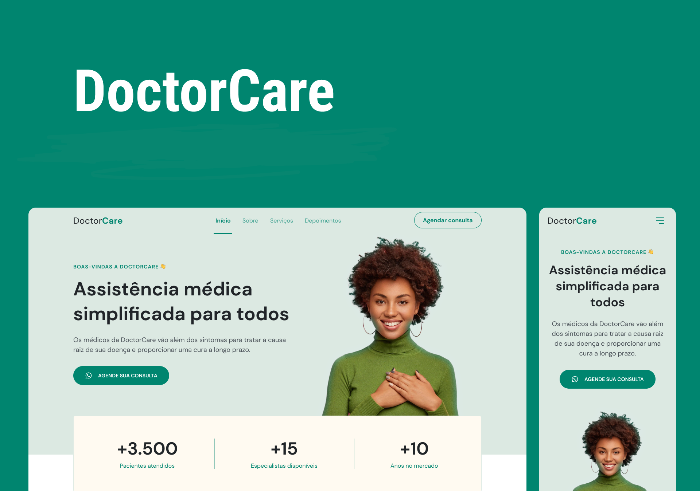

<h1 align="center">Doctor Care</h1>
<p align="center">Aplicação fictícia no formato de landing page, responsiva.</p> 

### ☁️ Deploy:
O <a href="https://enzotrevisann.github.io/challenge04/">Doctor Care</a> está hospedado no GitHub Pages.


### 💻 Projeto:
Versão final do projeto, implementado um chatbot treinado e funcional em uma página institucional fictícia no formato One Page.


### 🎯 Objetivo:
Melhorar a Customer Experience (CX) da "empresa" Doctor Care através da implementação de um chatbot para tirar dúvidas.
<br /> <br />

### ⚙️ Tecnologias:
- HTML
- CSS
- JavaScript
- BotSonic
<br /> <br />

### 📷 Tela inicial:


<br />

### 📂 Como rodar o projeto:

##### Passo 1. Clone este repositório pelo seu terminal:
```
$ git clone https://github.com/EnzoTrevisann/challenge04.git
```
##### Passo 2. Acesse a pasta do projeto:
```
$ cd challenge04
```
##### Passo 3. Abra o projeto no seu editor de código favorito.